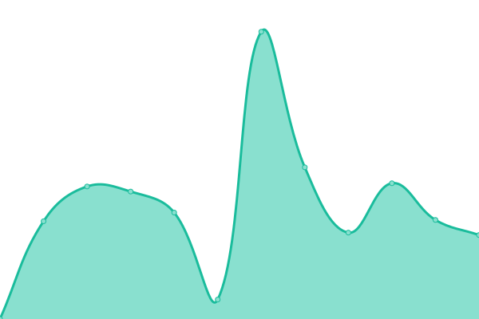

# [📈 Live Status](https://status.openfoodfacts.org/): <!--live status--> **🟧 Partial outage**

This repository contains the open-source uptime [monitor and status page for Open Food Facts](<[https://upptime.js.org](https://status.openfoodfacts.org/)>), powered by [Upptime](https://github.com/upptime/upptime).

With [Upptime](https://upptime.js.org), you can get your own unlimited and free uptime monitor and status page, powered entirely by a GitHub repository. We use [Issues](https://github.com/upptime/upptime/issues) as incident reports, [Actions](https://github.com/openfoodfacts/openfoodfacts-upptime/actions) as uptime monitors, and [Pages](https://upptime.github.io/upptime) for the status page.

<!--start: status pages-->
<!-- This summary is generated by Upptime (https://github.com/upptime/upptime) -->
<!-- Do not edit this manually, your changes will be overwritten -->
<!-- prettier-ignore -->
| URL | Status | History | Response Time | Uptime |
| --- | ------ | ------- | ------------- | ------ |
|  [Main website (Open Food Facts)](https://world.openfoodfacts.org) | 🟥 Down | [main-website-open-food-facts.yml](https://github.com/openfoodfacts/openfoodfacts-upptime/commits/HEAD/history/main-website-open-food-facts.yml) | 

 1639ms
     
 | 

<a href="https://status.openfoodfacts.org/history/main-website-open-food-facts">98.93%</a>
    

|  [Pro Platform (Open Food Facts)](https://world.pro.openfoodfacts.org) | 🟥 Down | [pro-platform-open-food-facts.yml](https://github.com/openfoodfacts/openfoodfacts-upptime/commits/HEAD/history/pro-platform-open-food-facts.yml) | 

 767ms
     
 | 

<a href="https://status.openfoodfacts.org/history/pro-platform-open-food-facts">98.98%</a>
    

|  [API v3](https://world.openfoodfacts.org/api/v3/product/3175681257511?fields=product_name,code) | 🟥 Down | [api-v3.yml](https://github.com/openfoodfacts/openfoodfacts-upptime/commits/HEAD/history/api-v3.yml) | 

 151ms
     
 | 

<a href="https://status.openfoodfacts.org/history/api-v3">99.02%</a>
    

|  [API v2](https://world.openfoodfacts.org/api/v2/product/3175681257511?fields=product_name,code) | 🟥 Down | [api-v2.yml](https://github.com/openfoodfacts/openfoodfacts-upptime/commits/HEAD/history/api-v2.yml) | 

 125ms
     
 | 

<a href="https://status.openfoodfacts.org/history/api-v2">99.06%</a>
    

|  [Open Food Facts Images](https://images.openfoodfacts.org/images/products/326/385/988/3713/front_fr.19.100.jpg) | 🟩 Up | [open-food-facts-images.yml](https://github.com/openfoodfacts/openfoodfacts-upptime/commits/HEAD/history/open-food-facts-images.yml) | 

 930ms
     
 | 

<a href="https://status.openfoodfacts.org/history/open-food-facts-images">100.00%</a>
    

|  [Hunger Games](https://hunger.openfoodfacts.org) | 🟩 Up | [hunger-games.yml](https://github.com/openfoodfacts/openfoodfacts-upptime/commits/HEAD/history/hunger-games.yml) | 

 402ms
     
 | 

<a href="https://status.openfoodfacts.org/history/hunger-games">100.00%</a>
    

|  [Folksonomy Engine](https://api.folksonomy.openfoodfacts.org) | 🟩 Up | [folksonomy-engine.yml](https://github.com/openfoodfacts/openfoodfacts-upptime/commits/HEAD/history/folksonomy-engine.yml) | 

 984ms
     
 | 

<a href="https://status.openfoodfacts.org/history/folksonomy-engine">100.00%</a>
    

|  [Blog](https://blog.openfoodfacts.org) | 🟩 Up | [blog.yml](https://github.com/openfoodfacts/openfoodfacts-upptime/commits/HEAD/history/blog.yml) | 

 1442ms
     
 | 

<a href="https://status.openfoodfacts.org/history/blog">100.00%</a>
    

|  [Support platform](https://support.openfoodfacts.org) | 🟩 Up | [support-platform.yml](https://github.com/openfoodfacts/openfoodfacts-upptime/commits/HEAD/history/support-platform.yml) | 

 1226ms
     
 | 

<a href="https://status.openfoodfacts.org/history/support-platform">100.00%</a>
    

|  [Analytics platform](https://analytics.openfoodfacts.org) | 🟩 Up | [analytics-platform.yml](https://github.com/openfoodfacts/openfoodfacts-upptime/commits/HEAD/history/analytics-platform.yml) | 

 1334ms
     
 | 

<a href="https://status.openfoodfacts.org/history/analytics-platform">100.00%</a>
    

|  [Metrics platform](https://metrics.openfoodfacts.org) | 🟩 Up | [metrics-platform.yml](https://github.com/openfoodfacts/openfoodfacts-upptime/commits/HEAD/history/metrics-platform.yml) | 

 1022ms
     
 | 

<a href="https://status.openfoodfacts.org/history/metrics-platform">100.00%</a>
    

|  [Connect platform (Odoo CRM)](https://connect.openfoodfacts.org) | 🟩 Up | [connect-platform-odoo-crm.yml](https://github.com/openfoodfacts/openfoodfacts-upptime/commits/HEAD/history/connect-platform-odoo-crm.yml) | 

 1186ms
     
 | 

<a href="https://status.openfoodfacts.org/history/connect-platform-odoo-crm">100.00%</a>
    

|  [Monitoring platform](https://alertmanager.openfoodfacts.org/#/alerts) | 🟩 Up | [monitoring-platform.yml](https://github.com/openfoodfacts/openfoodfacts-upptime/commits/HEAD/history/monitoring-platform.yml) | 

 775ms
     
 | 

<a href="https://status.openfoodfacts.org/history/monitoring-platform">100.00%</a>
    

|  [Prometheus](https://prometheus.openfoodfacts.org/-/healthy) | 🟩 Up | [prometheus.yml](https://github.com/openfoodfacts/openfoodfacts-upptime/commits/HEAD/history/prometheus.yml) | 

 811ms
     
 | 

<a href="https://status.openfoodfacts.org/history/prometheus">100.00%</a>
    

|  [Search](https://search.openfoodfacts.org/?q=Nutella) | 🟩 Up | [search.yml](https://github.com/openfoodfacts/openfoodfacts-upptime/commits/HEAD/history/search.yml) | 

 942ms
     
 | 

<a href="https://status.openfoodfacts.org/history/search">100.00%</a>
    

|  [Robotoff](https://robotoff.openfoodfacts.org/api/v1/health) | 🟩 Up | [robotoff.yml](https://github.com/openfoodfacts/openfoodfacts-upptime/commits/HEAD/history/robotoff.yml) | 

 2015ms
     
 | 

<a href="https://status.openfoodfacts.org/history/robotoff">99.78%</a>
    

|  [Nutri-Patrol](https://nutripatrol.openfoodfacts.org) | 🟩 Up | [nutri-patrol.yml](https://github.com/openfoodfacts/openfoodfacts-upptime/commits/HEAD/history/nutri-patrol.yml) | 

 766ms
     
 | 

<a href="https://status.openfoodfacts.org/history/nutri-patrol">100.00%</a>
    

|  [Knowledge panels for facets](https://facets-kp.openfoodfacts.org/render-to-html?facet_tag=categories&value_tag=en:open-beauty-facts&lang_code=en&country=world) | 🟩 Up | [knowledge-panels-for-facets.yml](https://github.com/openfoodfacts/openfoodfacts-upptime/commits/HEAD/history/knowledge-panels-for-facets.yml) | 

 843ms
     
 | 

<a href="https://status.openfoodfacts.org/history/knowledge-panels-for-facets">100.00%</a>
    

|  [Taxonomy editor](https://ui.taxonomy.openfoodfacts.org) | 🟩 Up | [taxonomy-editor.yml](https://github.com/openfoodfacts/openfoodfacts-upptime/commits/HEAD/history/taxonomy-editor.yml) | 

 685ms
     
 | 

<a href="https://status.openfoodfacts.org/history/taxonomy-editor">100.00%</a>
    

|  [Open Prices API](https://prices.openfoodfacts.org/api/v1/status) | 🟩 Up | [open-prices-api.yml](https://github.com/openfoodfacts/openfoodfacts-upptime/commits/HEAD/history/open-prices-api.yml) | 

 692ms
     
 | 

<a href="https://status.openfoodfacts.org/history/open-prices-api">100.00%</a>
    

|  [Open Prices UI](https://prices.openfoodfacts.org/app) | 🟩 Up | [open-prices-ui.yml](https://github.com/openfoodfacts/openfoodfacts-upptime/commits/HEAD/history/open-prices-ui.yml) | 

 135ms
     
 | 

<a href="https://status.openfoodfacts.org/history/open-prices-ui">100.00%</a>
    

|  [Made Near Me](https://madenear.me) | 🟥 Down | [made-near-me.yml](https://github.com/openfoodfacts/openfoodfacts-upptime/commits/HEAD/history/made-near-me.yml) | 

 3899ms
     
 | 

<a href="https://status.openfoodfacts.org/history/made-near-me">98.85%</a>
    

|  [Emballé près de chez vous](https://cestemballepresdechezvous.fr) | 🟥 Down | [emballe-pres-de-chez-vous.yml](https://github.com/openfoodfacts/openfoodfacts-upptime/commits/HEAD/history/emballe-pres-de-chez-vous.yml) | 

 3440ms
     
 | 

<a href="https://status.openfoodfacts.org/history/emballe-pres-de-chez-vous">98.98%</a>
    

|  [Combien de Sucres](https://combiendesucres.fr) | 🟥 Down | [combien-de-sucres.yml](https://github.com/openfoodfacts/openfoodfacts-upptime/commits/HEAD/history/combien-de-sucres.yml) | 

 718ms
     
 | 

<a href="https://status.openfoodfacts.org/history/combien-de-sucres">99.17%</a>
    

|  [How Much Sugar](https://howmuchsugar.in) | 🟥 Down | [how-much-sugar.yml](https://github.com/openfoodfacts/openfoodfacts-upptime/commits/HEAD/history/how-much-sugar.yml) | 

 529ms
     
 | 

<a href="https://status.openfoodfacts.org/history/how-much-sugar">99.21%</a>
    

|  [Wiki](https://wiki.openfoodfacts.org) | 🟩 Up | [wiki.yml](https://github.com/openfoodfacts/openfoodfacts-upptime/commits/HEAD/history/wiki.yml) | 

 1154ms
     
 | 

<a href="https://status.openfoodfacts.org/history/wiki">99.95%</a>
    

|  [Forum](https://forum.openfoodfacts.org) | 🟩 Up | [forum.yml](https://github.com/openfoodfacts/openfoodfacts-upptime/commits/HEAD/history/forum.yml) | 

 970ms
     
 | 

<a href="https://status.openfoodfacts.org/history/forum">100.00%</a>
    

|  [Open Beauty Facts](https://world.openbeautyfacts.org) | 🟥 Down | [open-beauty-facts.yml](https://github.com/openfoodfacts/openfoodfacts-upptime/commits/HEAD/history/open-beauty-facts.yml) | 

 1445ms
     
 | 

<a href="https://status.openfoodfacts.org/history/open-beauty-facts">99.25%</a>
    

|  [Open Pet Food Facts](https://world.openpetfoodfacts.org) | 🟥 Down | [open-pet-food-facts.yml](https://github.com/openfoodfacts/openfoodfacts-upptime/commits/HEAD/history/open-pet-food-facts.yml) | 

 1352ms
     
 | 

<a href="https://status.openfoodfacts.org/history/open-pet-food-facts">99.29%</a>
    

|  [Open Products Facts](https://world.openproductsfacts.org) | 🟥 Down | [open-products-facts.yml](https://github.com/openfoodfacts/openfoodfacts-upptime/commits/HEAD/history/open-products-facts.yml) | 

 1367ms
     
 | 

<a href="https://status.openfoodfacts.org/history/open-products-facts">99.34%</a>
    

|  [Contribalim](https://contribalim.openfoodfacts.org) | 🟩 Up | [contribalim.yml](https://github.com/openfoodfacts/openfoodfacts-upptime/commits/HEAD/history/contribalim.yml) | 

 462ms
     
 | 

<a href="https://status.openfoodfacts.org/history/contribalim">100.00%</a>
    

|  [Open Food Facts Query](https://query.openfoodfacts.org/health) | 🟥 Down | [open-food-facts-query.yml](https://github.com/openfoodfacts/openfoodfacts-upptime/commits/HEAD/history/open-food-facts-query.yml) | 

 789ms
     
 | 

<a href="https://status.openfoodfacts.org/history/open-food-facts-query">99.38%</a>
    

|  [Datasette instance (Mirabelle)](https://mirabelle.openfoodfacts.org) | 🟩 Up | [datasette-instance-mirabelle.yml](https://github.com/openfoodfacts/openfoodfacts-upptime/commits/HEAD/history/datasette-instance-mirabelle.yml) | 

 707ms
     
 | 

<a href="https://status.openfoodfacts.org/history/datasette-instance-mirabelle">92.33%</a>
    

|  [Staging deployment](https://world.openfoodfacts.net) | 🟩 Up | [staging-deployment.yml](https://github.com/openfoodfacts/openfoodfacts-upptime/commits/HEAD/history/staging-deployment.yml) | 

 1437ms
     
 | 

<a href="https://status.openfoodfacts.org/history/staging-deployment">99.80%</a>
    

|  [Nutri-Patrol (Staging)](https://nutripatrol.openfoodfacts.net) | 🟩 Up | [nutri-patrol-staging.yml](https://github.com/openfoodfacts/openfoodfacts-upptime/commits/HEAD/history/nutri-patrol-staging.yml) | 

 763ms
     
 | 

<a href="https://status.openfoodfacts.org/history/nutri-patrol-staging">100.00%</a>
    

|  [Knowledge panels for facets (Staging)](https://facets-kp.openfoodfacts.net/render-to-html?facet_tag=categories&value_tag=en:open-beauty-facts&lang_code=en&country=world) | 🟩 Up | [knowledge-panels-for-facets-staging.yml](https://github.com/openfoodfacts/openfoodfacts-upptime/commits/HEAD/history/knowledge-panels-for-facets-staging.yml) | 

 801ms
     
 | 

<a href="https://status.openfoodfacts.org/history/knowledge-panels-for-facets-staging">100.00%</a>
    

|  [Search (Staging)](https://search.openfoodfacts.net/?q=Nutella) | 🟩 Up | [search-staging.yml](https://github.com/openfoodfacts/openfoodfacts-upptime/commits/HEAD/history/search-staging.yml) | 

 1024ms
     
 | 

<a href="https://status.openfoodfacts.org/history/search-staging">100.00%</a>
    

|  [Taxonomy editor (Staging)](https://ui.taxonomy.openfoodfacts.net) | 🟩 Up | [taxonomy-editor-staging.yml](https://github.com/openfoodfacts/openfoodfacts-upptime/commits/HEAD/history/taxonomy-editor-staging.yml) | 

 754ms
     
 | 

<a href="https://status.openfoodfacts.org/history/taxonomy-editor-staging">100.00%</a>
    

|  [Open Prices API (Staging)](https://prices.openfoodfacts.net/api/v1/status) | 🟩 Up | [open-prices-api-staging.yml](https://github.com/openfoodfacts/openfoodfacts-upptime/commits/HEAD/history/open-prices-api-staging.yml) | 

 782ms
     
 | 

<a href="https://status.openfoodfacts.org/history/open-prices-api-staging">99.93%</a>
    

<!--end: status pages-->

[**Visit Open Food Facts status website →**](https://status.openfoodfacts.org/)

## 📄 License

- Powered by: [Upptime](https://github.com/upptime/upptime)
- Code: [MIT](./LICENSE) © [Upptime](https://upptime.js.org)
- Data in the `./history` directory: [Open Database License](https://opendatacommons.org/licenses/odbl/1-0/)
