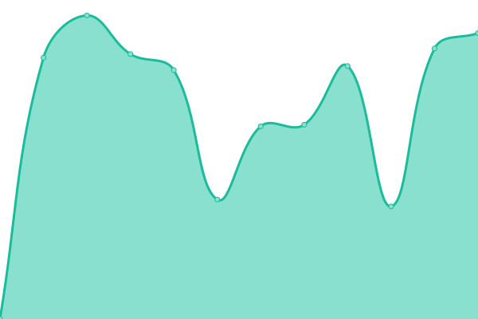

# [📈 Live Status](https://openfoodfacts.github.io/openfoodfacts-upptime/): <!--live status--> **🟧 Partial outage**

This repository contains the open-source uptime monitor and status page for [Upptime](https://upptime.js.org), powered by [Upptime](https://github.com/upptime/upptime).

With [Upptime](https://upptime.js.org), you can get your own unlimited and free uptime monitor and status page, powered entirely by a GitHub repository. We use [Issues](https://github.com/upptime/upptime/issues) as incident reports, [Actions](https://github.com/VaiTon/openfoodfacts-upptime/actions) as uptime monitors, and [Pages](https://upptime.github.io/upptime) for the status page.

<!--start: status pages-->
<!-- This summary is generated by Upptime (https://github.com/upptime/upptime) -->
<!-- Do not edit this manually, your changes will be overwritten -->
<!-- prettier-ignore -->
| URL | Status | History | Response Time | Uptime |
| --- | ------ | ------- | ------------- | ------ |
|  [Main website](https://world.openfoodfacts.org) | 🟩 Up | [main-website.yml](https://github.com/openfoodfacts/openfoodfacts-upptime/commits/HEAD/history/main-website.yml) | 

 5053ms
     
 | 

<a href="https://status.openfoodfacts.org/history/main-website">99.86%</a>
    

|  [API v3](https://world.openfoodfacts.org/api/v3/product/111111.json) | 🟥 Down | [api-v3.yml](https://github.com/openfoodfacts/openfoodfacts-upptime/commits/HEAD/history/api-v3.yml) | 

 251ms
     
 | 

<a href="https://status.openfoodfacts.org/history/api-v3">0.00%</a>
    

|  [API v2](https://world.openfoodfacts.org/api/v2/product/111111.json) | 🟥 Down | [api-v2.yml](https://github.com/openfoodfacts/openfoodfacts-upptime/commits/HEAD/history/api-v2.yml) | 

 300ms
     
 | 

<a href="https://status.openfoodfacts.org/history/api-v2">0.00%</a>
    

|  [Open Food Facts Images](https://images.openfoodfacts.org/images/products/326/385/988/3713/front_fr.19.100.jpg) | 🟩 Up | [open-food-facts-images.yml](https://github.com/openfoodfacts/openfoodfacts-upptime/commits/HEAD/history/open-food-facts-images.yml) | 

 1443ms
     
 | 

<a href="https://status.openfoodfacts.org/history/open-food-facts-images">100.00%</a>
    

|  [Staging deployment](https://world.openfoodfacts.net) | 🟩 Up | [staging-deployment.yml](https://github.com/openfoodfacts/openfoodfacts-upptime/commits/HEAD/history/staging-deployment.yml) | 

 2175ms
     
 | 

<a href="https://status.openfoodfacts.org/history/staging-deployment">97.19%</a>
    

|  [Hunger Games](https://hunger.openfoodfacts.org) | 🟩 Up | [hunger-games.yml](https://github.com/openfoodfacts/openfoodfacts-upptime/commits/HEAD/history/hunger-games.yml) | 

 253ms
     
 | 

<a href="https://status.openfoodfacts.org/history/hunger-games">100.00%</a>
    

|  [Folksonomy Engine](https://api.folksonomy.openfoodfacts.org) | 🟩 Up | [folksonomy-engine.yml](https://github.com/openfoodfacts/openfoodfacts-upptime/commits/HEAD/history/folksonomy-engine.yml) | 

 890ms
     
 | 

<a href="https://status.openfoodfacts.org/history/folksonomy-engine">99.93%</a>
    

|  [Blog](https://blog.openfoodfacts.org) | 🟩 Up | [blog.yml](https://github.com/openfoodfacts/openfoodfacts-upptime/commits/HEAD/history/blog.yml) | 

 1557ms
     
 | 

<a href="https://status.openfoodfacts.org/history/blog">100.00%</a>
    

|  [Support platform](https://support.openfoodfacts.org) | 🟥 Down | [support-platform.yml](https://github.com/openfoodfacts/openfoodfacts-upptime/commits/HEAD/history/support-platform.yml) | 

 1267ms
     
 | 

<a href="https://status.openfoodfacts.org/history/support-platform">76.85%</a>
    

|  [Analytics platform](https://analytics.openfoodfacts.org) | 🟩 Up | [analytics-platform.yml](https://github.com/openfoodfacts/openfoodfacts-upptime/commits/HEAD/history/analytics-platform.yml) | 

 1273ms
     
 | 

<a href="https://status.openfoodfacts.org/history/analytics-platform">74.58%</a>
    

|  [Metrics platform](https://metrics.openfoodfacts.org) | 🟩 Up | [metrics-platform.yml](https://github.com/openfoodfacts/openfoodfacts-upptime/commits/HEAD/history/metrics-platform.yml) | 

 1040ms
     
 | 

<a href="https://status.openfoodfacts.org/history/metrics-platform">100.00%</a>
    

|  [Connect platform](https://connect.openfoodfacts.org/) | 🟩 Up | [connect-platform.yml](https://github.com/openfoodfacts/openfoodfacts-upptime/commits/HEAD/history/connect-platform.yml) | 

 1523ms
     
 | 

<a href="https://status.openfoodfacts.org/history/connect-platform">100.00%</a>
    

|  [Monitoring platform](https://alertmanager.openfoodfacts.org/#/alerts) | 🟩 Up | [monitoring-platform.yml](https://github.com/openfoodfacts/openfoodfacts-upptime/commits/HEAD/history/monitoring-platform.yml) | 

 798ms
     
 | 

<a href="https://status.openfoodfacts.org/history/monitoring-platform">100.00%</a>
    

<!--end: status pages-->

[**Visit our status website →**](https://upptime.github.io/upptime)

## 📄 License

- Powered by: [Upptime](https://github.com/upptime/upptime)
- Code: [MIT](./LICENSE) © [Upptime](https://upptime.js.org)
- Data in the `./history` directory: [Open Database License](https://opendatacommons.org/licenses/odbl/1-0/)
