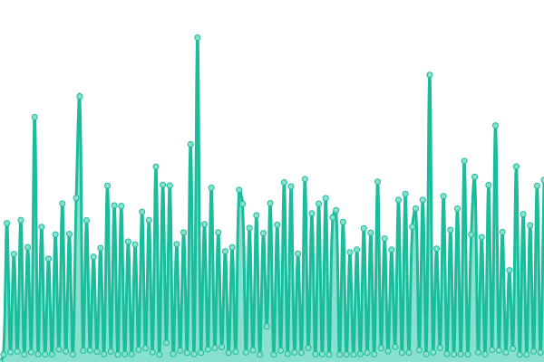
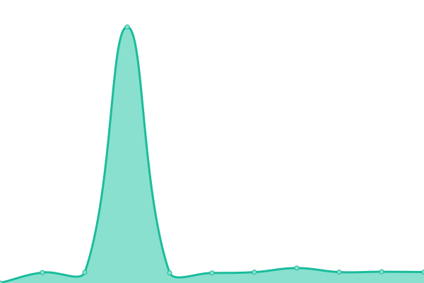

# [📈 Live Status](https://status.openfoodfacts.org/): <!--live status--> **🟧 Partial outage**

This repository contains the open-source uptime [monitor and status page for Open Food Facts](<[https://upptime.js.org](https://status.openfoodfacts.org/)>), powered by [Upptime](https://github.com/upptime/upptime).

With [Upptime](https://upptime.js.org), you can get your own unlimited and free uptime monitor and status page, powered entirely by a GitHub repository. We use [Issues](https://github.com/upptime/upptime/issues) as incident reports, [Actions](https://github.com/openfoodfacts/openfoodfacts-upptime/actions) as uptime monitors, and [Pages](https://upptime.github.io/upptime) for the status page.

<!--start: status pages-->
<!-- This summary is generated by Upptime (https://github.com/upptime/upptime) -->
<!-- Do not edit this manually, your changes will be overwritten -->
<!-- prettier-ignore -->
| URL | Status | History | Response Time | Uptime |
| --- | ------ | ------- | ------------- | ------ |
|  [Main website (Open Food Facts)](https://world.openfoodfacts.org) | 🟩 Up | [main-website-open-food-facts.yml](https://github.com/openfoodfacts/openfoodfacts-upptime/commits/HEAD/history/main-website-open-food-facts.yml) | 

 3850ms
     
 | 

<a href="https://status.openfoodfacts.org/history/main-website-open-food-facts">89.04%</a>
    

|  [Pro Platform (Open Food Facts)](https://world.pro.openfoodfacts.org) | 🟩 Up | [pro-platform-open-food-facts.yml](https://github.com/openfoodfacts/openfoodfacts-upptime/commits/HEAD/history/pro-platform-open-food-facts.yml) | 

 667ms
     
 | 

<a href="https://status.openfoodfacts.org/history/pro-platform-open-food-facts">58.12%</a>
    

|  [API v3](https://world.openfoodfacts.org/api/v3/product/3175681257511?fields=product_name,code) | 🟩 Up | [api-v3.yml](https://github.com/openfoodfacts/openfoodfacts-upptime/commits/HEAD/history/api-v3.yml) | 

 887ms
     
 | 

<a href="https://status.openfoodfacts.org/history/api-v3">89.16%</a>
    

|  [API v2](https://world.openfoodfacts.org/api/v2/product/3175681257511?fields=product_name,code) | 🟩 Up | [api-v2.yml](https://github.com/openfoodfacts/openfoodfacts-upptime/commits/HEAD/history/api-v2.yml) | 

 1762ms
     
 | 

<a href="https://status.openfoodfacts.org/history/api-v2">99.27%</a>
    

|  [Search API v2](https://world.openfoodfacts.org/cgi/search.pl?search_terms=banania&search_simple=1&action=process&json=1) | 🟥 Down | [search-api-v2.yml](https://github.com/openfoodfacts/openfoodfacts-upptime/commits/HEAD/history/search-api-v2.yml) | 

 1368ms
     
 | 

<a href="https://status.openfoodfacts.org/history/search-api-v2">59.90%</a>
    

|  [Open Food Facts Images](https://images.openfoodfacts.org/images/products/326/385/988/3713/front_fr.19.100.jpg) | 🟩 Up | [open-food-facts-images.yml](https://github.com/openfoodfacts/openfoodfacts-upptime/commits/HEAD/history/open-food-facts-images.yml) | 

 924ms
     
 | 

<a href="https://status.openfoodfacts.org/history/open-food-facts-images">100.00%</a>
    

|  [Hunger Games](https://hunger.openfoodfacts.org) | 🟩 Up | [hunger-games.yml](https://github.com/openfoodfacts/openfoodfacts-upptime/commits/HEAD/history/hunger-games.yml) | 

 359ms
     
 | 

<a href="https://status.openfoodfacts.org/history/hunger-games">100.00%</a>
    

|  [Folksonomy Engine](https://api.folksonomy.openfoodfacts.org) | 🟩 Up | [folksonomy-engine.yml](https://github.com/openfoodfacts/openfoodfacts-upptime/commits/HEAD/history/folksonomy-engine.yml) | 

 849ms
     
 | 

<a href="https://status.openfoodfacts.org/history/folksonomy-engine">99.50%</a>
    

|  [Blog](https://blog.openfoodfacts.org) | 🟩 Up | [blog.yml](https://github.com/openfoodfacts/openfoodfacts-upptime/commits/HEAD/history/blog.yml) | 

 1559ms
     
 | 

<a href="https://status.openfoodfacts.org/history/blog">99.51%</a>
    

|  [Support platform](https://support.openfoodfacts.org) | 🟩 Up | [support-platform.yml](https://github.com/openfoodfacts/openfoodfacts-upptime/commits/HEAD/history/support-platform.yml) | 

 832ms
     
 | 

<a href="https://status.openfoodfacts.org/history/support-platform">100.00%</a>
    

|  [Analytics platform](https://analytics.openfoodfacts.org) | 🟩 Up | [analytics-platform.yml](https://github.com/openfoodfacts/openfoodfacts-upptime/commits/HEAD/history/analytics-platform.yml) | 

 1232ms
     
 | 

<a href="https://status.openfoodfacts.org/history/analytics-platform">99.79%</a>
    

|  [Metrics platform](https://metrics.openfoodfacts.org) | 🟩 Up | [metrics-platform.yml](https://github.com/openfoodfacts/openfoodfacts-upptime/commits/HEAD/history/metrics-platform.yml) | 

 1012ms
     
 | 

<a href="https://status.openfoodfacts.org/history/metrics-platform">99.60%</a>
    

|  [Connect platform (Odoo CRM)](https://connect.openfoodfacts.org) | 🟩 Up | [connect-platform-odoo-crm.yml](https://github.com/openfoodfacts/openfoodfacts-upptime/commits/HEAD/history/connect-platform-odoo-crm.yml) | 

 1316ms
     
 | 

<a href="https://status.openfoodfacts.org/history/connect-platform-odoo-crm">99.80%</a>
    

|  [Monitoring platform](https://alertmanager.openfoodfacts.org/#/alerts) | 🟩 Up | [monitoring-platform.yml](https://github.com/openfoodfacts/openfoodfacts-upptime/commits/HEAD/history/monitoring-platform.yml) | 

 2108ms
     
 | 

<a href="https://status.openfoodfacts.org/history/monitoring-platform">100.00%</a>
    

|  [Prometheus](https://prometheus.openfoodfacts.org/-/healthy) | 🟩 Up | [prometheus.yml](https://github.com/openfoodfacts/openfoodfacts-upptime/commits/HEAD/history/prometheus.yml) | 

 1678ms
     
 | 

<a href="https://status.openfoodfacts.org/history/prometheus">100.00%</a>
    

|  [Search](https://search.openfoodfacts.org/?q=Nutella) | 🟩 Up | [search.yml](https://github.com/openfoodfacts/openfoodfacts-upptime/commits/HEAD/history/search.yml) | 

 921ms
     
 | 

<a href="https://status.openfoodfacts.org/history/search">99.80%</a>
    

|  [Robotoff](https://robotoff.openfoodfacts.org/api/v1/health) | 🟩 Up | [robotoff.yml](https://github.com/openfoodfacts/openfoodfacts-upptime/commits/HEAD/history/robotoff.yml) | 

 905ms
     
 | 

<a href="https://status.openfoodfacts.org/history/robotoff">99.32%</a>
    

|  [Nutri-Patrol](https://nutripatrol.openfoodfacts.org) | 🟩 Up | [nutri-patrol.yml](https://github.com/openfoodfacts/openfoodfacts-upptime/commits/HEAD/history/nutri-patrol.yml) | 

 743ms
     
 | 

<a href="https://status.openfoodfacts.org/history/nutri-patrol">100.00%</a>
    

|  [Knowledge panels for facets](https://facets-kp.openfoodfacts.org/render-to-html?facet_tag=categories&value_tag=en:open-beauty-facts&lang_code=en&country=world) | 🟩 Up | [knowledge-panels-for-facets.yml](https://github.com/openfoodfacts/openfoodfacts-upptime/commits/HEAD/history/knowledge-panels-for-facets.yml) | 

 1275ms
     
 | 

<a href="https://status.openfoodfacts.org/history/knowledge-panels-for-facets">100.00%</a>
    

|  [Taxonomy editor](https://ui.taxonomy.openfoodfacts.org) | 🟩 Up | [taxonomy-editor.yml](https://github.com/openfoodfacts/openfoodfacts-upptime/commits/HEAD/history/taxonomy-editor.yml) | 

 739ms
     
 | 

<a href="https://status.openfoodfacts.org/history/taxonomy-editor">100.00%</a>
    

|  [Open Prices API](https://prices.openfoodfacts.org/api/v1/status) | 🟩 Up | [open-prices-api.yml](https://github.com/openfoodfacts/openfoodfacts-upptime/commits/HEAD/history/open-prices-api.yml) | 

 704ms
     
 | 

<a href="https://status.openfoodfacts.org/history/open-prices-api">100.00%</a>
    

|  [Open Prices UI](https://prices.openfoodfacts.org/app) | 🟩 Up | [open-prices-ui.yml](https://github.com/openfoodfacts/openfoodfacts-upptime/commits/HEAD/history/open-prices-ui.yml) | 

 133ms
     
 | 

<a href="https://status.openfoodfacts.org/history/open-prices-ui">100.00%</a>
    

|  [Made Near Me](https://madenear.me) | 🟩 Up | [made-near-me.yml](https://github.com/openfoodfacts/openfoodfacts-upptime/commits/HEAD/history/made-near-me.yml) | 

 4505ms
     
 | 

<a href="https://status.openfoodfacts.org/history/made-near-me">99.76%</a>
    

|  [Emballé près de chez vous](https://cestemballepresdechezvous.fr) | 🟩 Up | [emballe-pres-de-chez-vous.yml](https://github.com/openfoodfacts/openfoodfacts-upptime/commits/HEAD/history/emballe-pres-de-chez-vous.yml) | 

 4094ms
     
 | 

<a href="https://status.openfoodfacts.org/history/emballe-pres-de-chez-vous">99.76%</a>
    

|  [Combien de Sucres](https://combiendesucres.fr) | 🟩 Up | [combien-de-sucres.yml](https://github.com/openfoodfacts/openfoodfacts-upptime/commits/HEAD/history/combien-de-sucres.yml) | 

 707ms
     
 | 

<a href="https://status.openfoodfacts.org/history/combien-de-sucres">99.77%</a>
    

|  [How Much Sugar](https://howmuchsugar.in) | 🟩 Up | [how-much-sugar.yml](https://github.com/openfoodfacts/openfoodfacts-upptime/commits/HEAD/history/how-much-sugar.yml) | 

 553ms
     
 | 

<a href="https://status.openfoodfacts.org/history/how-much-sugar">99.77%</a>
    

|  [Wiki](https://wiki.openfoodfacts.org) | 🟩 Up | [wiki.yml](https://github.com/openfoodfacts/openfoodfacts-upptime/commits/HEAD/history/wiki.yml) | 

 670ms
     
 | 

<a href="https://status.openfoodfacts.org/history/wiki">100.00%</a>
    

|  [Forum](https://forum.openfoodfacts.org) | 🟩 Up | [forum.yml](https://github.com/openfoodfacts/openfoodfacts-upptime/commits/HEAD/history/forum.yml) | 

 990ms
     
 | 

<a href="https://status.openfoodfacts.org/history/forum">100.00%</a>
    

|  [Open Beauty Facts](https://world.openbeautyfacts.org) | 🟩 Up | [open-beauty-facts.yml](https://github.com/openfoodfacts/openfoodfacts-upptime/commits/HEAD/history/open-beauty-facts.yml) | 

 1366ms
     
 | 

<a href="https://status.openfoodfacts.org/history/open-beauty-facts">99.78%</a>
    

|  [Open Pet Food Facts](https://world.openpetfoodfacts.org) | 🟩 Up | [open-pet-food-facts.yml](https://github.com/openfoodfacts/openfoodfacts-upptime/commits/HEAD/history/open-pet-food-facts.yml) | 

 1560ms
     
 | 

<a href="https://status.openfoodfacts.org/history/open-pet-food-facts">99.55%</a>
    

|  [Open Products Facts](https://world.openproductsfacts.org) | 🟩 Up | [open-products-facts.yml](https://github.com/openfoodfacts/openfoodfacts-upptime/commits/HEAD/history/open-products-facts.yml) | 

 1263ms
     
 | 

<a href="https://status.openfoodfacts.org/history/open-products-facts">99.78%</a>
    

|  [Contribalim](https://contribalim.openfoodfacts.org) | 🟩 Up | [contribalim.yml](https://github.com/openfoodfacts/openfoodfacts-upptime/commits/HEAD/history/contribalim.yml) | 

 2052ms
     
 | 

<a href="https://status.openfoodfacts.org/history/contribalim">100.00%</a>
    

|  [Open Food Facts Query](https://query.openfoodfacts.org/health) | 🟩 Up | [open-food-facts-query.yml](https://github.com/openfoodfacts/openfoodfacts-upptime/commits/HEAD/history/open-food-facts-query.yml) | 

 1962ms
     
 | 

<a href="https://status.openfoodfacts.org/history/open-food-facts-query">99.79%</a>
    

|  [Datasette instance (Mirabelle)](https://mirabelle.openfoodfacts.org) | 🟩 Up | [datasette-instance-mirabelle.yml](https://github.com/openfoodfacts/openfoodfacts-upptime/commits/HEAD/history/datasette-instance-mirabelle.yml) | 

 630ms
     
 | 

<a href="https://status.openfoodfacts.org/history/datasette-instance-mirabelle">0.00%</a>
    

|  [Staging deployment](https://world.openfoodfacts.net) | 🟩 Up | [staging-deployment.yml](https://github.com/openfoodfacts/openfoodfacts-upptime/commits/HEAD/history/staging-deployment.yml) | 

 1531ms
     
 | 

<a href="https://status.openfoodfacts.org/history/staging-deployment">99.55%</a>
    

|  [Nutri-Patrol (Staging)](https://nutripatrol.openfoodfacts.net) | 🟩 Up | [nutri-patrol-staging.yml](https://github.com/openfoodfacts/openfoodfacts-upptime/commits/HEAD/history/nutri-patrol-staging.yml) | 

 795ms
     
 | 

<a href="https://status.openfoodfacts.org/history/nutri-patrol-staging">100.00%</a>
    

|  [Knowledge panels for facets (Staging)](https://facets-kp.openfoodfacts.net/render-to-html?facet_tag=categories&value_tag=en:open-beauty-facts&lang_code=en&country=world) | 🟩 Up | [knowledge-panels-for-facets-staging.yml](https://github.com/openfoodfacts/openfoodfacts-upptime/commits/HEAD/history/knowledge-panels-for-facets-staging.yml) | 

 810ms
     
 | 

<a href="https://status.openfoodfacts.org/history/knowledge-panels-for-facets-staging">100.00%</a>
    

|  [Search (Staging)](https://search.openfoodfacts.net/?q=Nutella) | 🟩 Up | [search-staging.yml](https://github.com/openfoodfacts/openfoodfacts-upptime/commits/HEAD/history/search-staging.yml) | 

 1029ms
     
 | 

<a href="https://status.openfoodfacts.org/history/search-staging">100.00%</a>
    

|  [Taxonomy editor (Staging)](https://ui.taxonomy.openfoodfacts.net) | 🟩 Up | [taxonomy-editor-staging.yml](https://github.com/openfoodfacts/openfoodfacts-upptime/commits/HEAD/history/taxonomy-editor-staging.yml) | 

 714ms
     
 | 

<a href="https://status.openfoodfacts.org/history/taxonomy-editor-staging">100.00%</a>
    

|  [Open Prices API (Staging)](https://prices.openfoodfacts.net/api/v1/status) | 🟩 Up | [open-prices-api-staging.yml](https://github.com/openfoodfacts/openfoodfacts-upptime/commits/HEAD/history/open-prices-api-staging.yml) | 

 743ms
     
 | 

<a href="https://status.openfoodfacts.org/history/open-prices-api-staging">100.00%</a>
    

|  [Keycloak](https://auth.openfoodfacts.org/) | 🟩 Up | [keycloak.yml](https://github.com/openfoodfacts/openfoodfacts-upptime/commits/HEAD/history/keycloak.yml) | 

 944ms
     
 | 

<a href="https://status.openfoodfacts.org/history/keycloak">100.00%</a>
    

|  [Superset (sql.off)](https://sql.openfoodfacts.org/) | 🟩 Up | [superset-sql-off.yml](https://github.com/openfoodfacts/openfoodfacts-upptime/commits/HEAD/history/superset-sql-off.yml) | 

 1109ms
     
 | 

<a href="https://status.openfoodfacts.org/history/superset-sql-off">99.76%</a>
    

<!--end: status pages-->

[**Visit Open Food Facts status website →**](https://status.openfoodfacts.org/)

## 📄 License

- Powered by: [Upptime](https://github.com/upptime/upptime)
- Code: [MIT](./LICENSE) © [Upptime](https://upptime.js.org)
- Data in the `./history` directory: [Open Database License](https://opendatacommons.org/licenses/odbl/1-0/)
